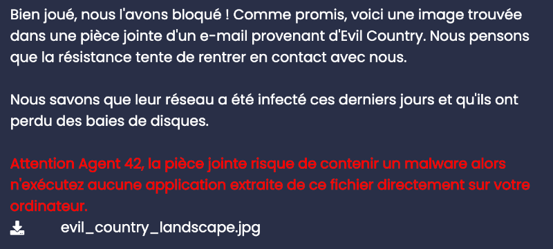
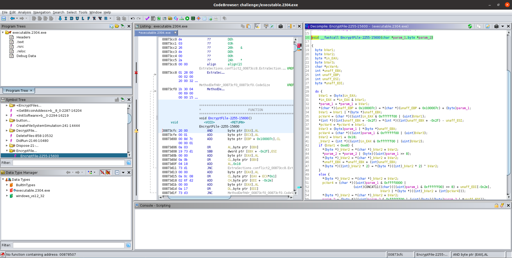
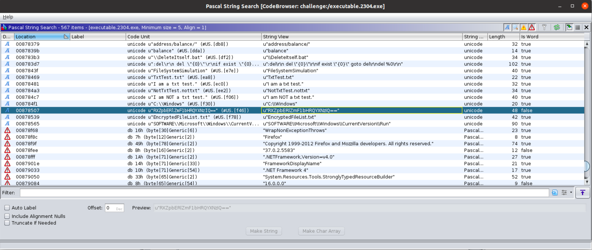
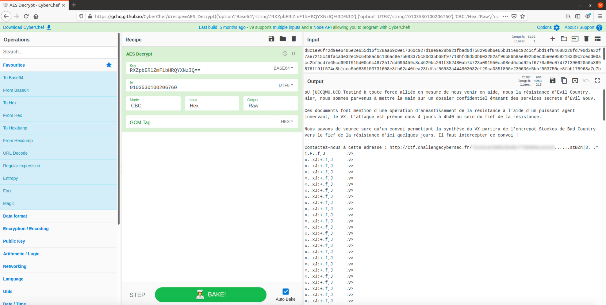

# Brigitte Friang CTF (Forensic Challenge)

*The “Brigitte Friang” challenge ([more information](https://www.esiee.fr/fr/actualite/challenge-brigitte-friang-2020-dgse-esiee), in French) was my first CTF. This challenge was composed of several subtasks. I solved one of them, the *Forensic* challenge, that I describe in this write-up.*

In a pseudo-chat, an agent, Alphonse Bertillon, has a request: scrutinize a JPG image (`evil_country_landscape.jpg`) to reveal some hidden information.



> ... here is an image found in an email attachment from evil country. We think the resistance is trying to get in touch with us.
> 
> We know that their network has been infected in the last few days and that they have lost hard drive trays.
> 
> Warning Agent 42, the attachment may contain malware so do not run any applications extracted from this file directly on your computer.
> 
> evil_country_landscape.jpg

Following the warning, an isolated Linux virtual machine is used to analyze the attachment.

Opening this file reveals a grim landscape.


# Quick Glance

Type?

```console
$ file evil_country_landscape.jpg 
evil_country_landscape.jpg: JPEG image data, JFIF standard 1.01, aspect ratio, density 1x1, segment length 16, 
progressive, precision 8, 640x436, components 3
```

Size?

```console
$ ls -l --block-size=M evil_country_landscape.jpg 
-rw-r--r-- 1 tmp tmp 303M Oct 30 15:50 evil_country_landscape.jpg
```

303MiB for a 640x436 JPEG file? 

It is indeed hiding something. 

In multiple layers as it appears.

# Extraction: Layer 1 / JPG → Disk Images


`binwalk` conveniently extracts the embedded files.

```console
$ binwalk -e evil_country_landscape.jpg 

DECIMAL       HEXADECIMAL     DESCRIPTION
--------------------------------------------------------------------------------
0             0x0             JPEG image data, JFIF standard 1.01
79798         0x137B6         Zip archive data, at least v2.0 to extract, uncompressed size: 173015040, name: part2.img
4775856       0x48DFB0        Zlib compressed data, best compression
34737670      0x2120E06       MySQL MISAM compressed data file Version 1
56164092      0x358FEFC       IMG0 (VxWorks) header, size: 257308484
128298187     0x7A5ACCB       Cisco IOS microcode, for "w%"
158637081     0x9749C19       Zip archive data, at least v2.0 to extract, uncompressed size: 173015040, name: part3.img
239002530     0xE3EE3A2       Zlib compressed data, best compression
317286906     0x12E969FA      End of Zip archive, footer length: 22
$ ls _evil_country_landscape.jpg.extracted/
137B6.zip  48DFB0  48DFB0.zlib  E3EE3A2  E3EE3A2.zlib  part2.img  part3.img
```

If the chat message has to be trusted, the `.img` files are probably disk images.

```console
$ file part2.img 
part2.img: Linux Software RAID version 1.2 (1) 
UUID=dfaa645a:19afec72:60f1fa33:30d841da name=user-XPS-15-9570:6 level=5 disks=3
$ file part2.img 
part3.img: Linux Software RAID version 1.2 (1) 
UUID=dfaa645a:19afec72:60f1fa33:30d841da name=user-XPS-15-9570:6 level=5 disks=3
```

```console
$ mdadm --examine part2.img
          Magic : a92b4efc
        Version : 1.2
    Feature Map : 0x0
     Array UUID : dfaa645a:19afec72:60f1fa33:30d841da
           Name : user-XPS-15-9570:6
  Creation Time : Tue Oct  6 11:29:56 2020
     Raid Level : raid5
   Raid Devices : 3

 Avail Dev Size : 333824 (163.00 MiB 170.92 MB)
     Array Size : 333824 (326.00 MiB 341.84 MB)
    Data Offset : 4096 sectors
   Super Offset : 8 sectors
   Unused Space : before=4016 sectors, after=0 sectors
          State : clean
    Device UUID : 666ea76a:5c750c31:b7c6c06b:1c9c7ee1

    Update Time : Tue Oct  6 14:38:08 2020
  Bad Block Log : 512 entries available at offset 16 sectors
       Checksum : 4fdf0461 - correct
         Events : 26

         Layout : left-symmetric
     Chunk Size : 512K

   Device Role : Active device 1
   Array State : .AA ('A' == active, '.' == missing, 'R' == replacing)
```
 
The `.img` files are indeed disk images part of a three disk RAID5 array. 

Relevant extracted files:
- `part2.img`
- `part3.img`

# Extraction: Layer 2 / RAID5 Disk Images → VMware Virtual Machine Paging File


Because only 2 disk images out of 3 (`part1.img` is nowhere to be found, in accordance with the chat message) have been restored, the array has to be brought up in degraded mode (one-disk failure mode).

```console
$ sudo losetup /dev/loop2 part2.img
$ sudo losetup /dev/loop3 part3.img
$ sudo mdadm --assemble --run --force --update=resync /dev/md0 /dev/loop2 /dev/loo3
$ sudo mount /dev/md0 /mnt/tmp
$ cd /mnt/tmp && ls
dump.zip  lost+found
$ unzip dump.zip && ls
dump.vmem  dump.vmem.sha256  dump.zip  lost+found
```

A `.vmem` file (VMware Virtual Machine paging file) is restored...

```console
$ sha256sum dump.vmem
dd170dfbb7046c18850b97ab0f7d7227ad03fbd0b692e60b10549b211373941b
$ cat dump.vmem.sha256 
dd170dfbb7046c18850b97ab0f7d7227ad03fbd0b692e60b10549b211373941b
```

... and intact.

Relevant extracted file:
- `dump.vmem`

Now, a third layer of extraction has to be performed.

# Extraction: Layer 3 / VMware Virtual Machine Paging File → Encrypted Files


At this stage, [Volatility](https://github.com/volatilityfoundation/volatility) is used to perform the analysis.

First step: identify the relevant profile.

```console
$ python vol.py -f /home/tmp/dump.vmem imageinfo
Volatility Foundation Volatility Framework 2.6
INFO    : volatility.debug    : Determining profile based on KDBG search...
          Suggested Profile(s) : Win7SP1x64, Win7SP0x64, Win2008R2SP0x64, Win2008R2SP1x64_23418, Win2008R2SP1x64, Win7SP1x64_23418
                     AS Layer1 : WindowsAMD64PagedMemory (Kernel AS)
                     AS Layer2 : FileAddressSpace (/home/tmp/dump.vmem)
                      PAE type : No PAE
                           DTB : 0x187000L
                          KDBG : 0xf80002c4c0a0L
          Number of Processors : 1
     Image Type (Service Pack) : 1
                KPCR for CPU 0 : 0xfffff80002c4dd00L
             KUSER_SHARED_DATA : 0xfffff78000000000L
           Image date and time : 2020-10-05 11:17:37 UTC+0000
     Image local date and time : 2020-10-05 13:17:37 +0200
```

The guest virtual machine is a Windows one. It should be noted that the  `Win7SP1x64` profile has been successfully used in the next steps.

Let's fetch the list of processes.

```console
$ python vol.py -f /home/tmp/dump.vmem --profile=Win7SP1x64 pslist
Volatility Foundation Volatility Framework 2.6
Offset(V)          Name                    PID   PPID   Thds     Hnds   Sess  Wow64 Start                          Exit                          
------------------ -------------------- ------ ------ ------ -------- ------ ------ ------------------------------ ------------------------------
0xfffffa8000cc5b30 System                    4      0     87      393 ------      0 2020-10-05 11:13:41 UTC+0000                                 
0xfffffa800bad5480 smss.exe                264      4      2       29 ------      0 2020-10-05 11:13:41 UTC+0000                                 
0xfffffa8002810060 csrss.exe               352    336      8      517      0      0 2020-10-05 11:13:42 UTC+0000                                 
0xfffffa8002816060 wininit.exe             404    336      3       74      0      0 2020-10-05 11:13:42 UTC+0000                                 
0xfffffa80111d32e0 csrss.exe               412    396      9      209      1      0 2020-10-05 11:13:42 UTC+0000                                 
0xfffffa80029c2910 winlogon.exe            460    396      4      110      1      0 2020-10-05 11:13:42 UTC+0000                                 
0xfffffa80029f76d0 services.exe            504    404      8      220      0      0 2020-10-05 11:13:42 UTC+0000                                 
0xfffffa8002a007c0 lsass.exe               512    404      7      565      0      0 2020-10-05 11:13:42 UTC+0000                                 
0xfffffa8002a0db30 lsm.exe                 520    404     10      145      0      0 2020-10-05 11:13:42 UTC+0000                                 
0xfffffa8002a0fb30 svchost.exe             644    504     10      353      0      0 2020-10-05 11:13:43 UTC+0000                                 
0xfffffa8002affb30 svchost.exe             708    504      6      276      0      0 2020-10-05 11:13:43 UTC+0000                                 
0xfffffa8002b1f4a0 svchost.exe             760    504     23      514      0      0 2020-10-05 11:13:43 UTC+0000                                 
0xfffffa8002b28b30 svchost.exe             880    504     16      320      0      0 2020-10-05 11:13:43 UTC+0000                                 
0xfffffa8002b8ab30 svchost.exe             920    504     48      979      0      0 2020-10-05 11:13:43 UTC+0000                                 
0xfffffa8002bb4b30 audiodg.exe             980    760      7      128      0      0 2020-10-05 11:13:44 UTC+0000                                 
0xfffffa8002bd4060 svchost.exe             244    504     26      720      0      0 2020-10-05 11:13:44 UTC+0000                                 
0xfffffa8002bf8060 svchost.exe             304    504     20      391      0      0 2020-10-05 11:13:44 UTC+0000                                 
0xfffffa8002c6b500 dwm.exe                1072    880      6      124      1      0 2020-10-05 11:13:44 UTC+0000                                 
0xfffffa8002c6fb30 explorer.exe           1084   1064     32      828      1      0 2020-10-05 11:13:44 UTC+0000                                 
0xfffffa8002cc6310 spoolsv.exe            1156    504     15      270      0      0 2020-10-05 11:13:44 UTC+0000                                 
0xfffffa8002d11a60 taskhost.exe           1216    504     10      204      1      0 2020-10-05 11:13:44 UTC+0000                                 
0xfffffa8002d234f0 vm3dservice.ex         1240   1084      3       39      1      0 2020-10-05 11:13:44 UTC+0000                                 
0xfffffa8002d27b30 vmtoolsd.exe           1248   1084      8      166      1      0 2020-10-05 11:13:44 UTC+0000                                 
0xfffffa8002d2ab30 svchost.exe            1304    504     20      325      0      0 2020-10-05 11:13:45 UTC+0000                                 
0xfffffa8002b6e430 VGAuthService.         1560    504      4       84      0      0 2020-10-05 11:13:46 UTC+0000                                 
0xfffffa8002b6f2c0 vmtoolsd.exe           1584    504     12      292      0      0 2020-10-05 11:13:46 UTC+0000                                 
0xfffffa8001e6ab30 dllhost.exe            1832    504     20      186      0      0 2020-10-05 11:13:47 UTC+0000                                 
0xfffffa8002f1f060 WmiPrvSE.exe           1892    644     10      193      0      0 2020-10-05 11:13:47 UTC+0000                                 
0xfffffa8002ef2b30 dllhost.exe            2008    504     17      195      0      0 2020-10-05 11:13:48 UTC+0000                                 
0xfffffa8002fc9560 msdtc.exe               872    504     15      155      0      0 2020-10-05 11:13:49 UTC+0000                                 
0xfffffa8003021690 VSSVC.exe              2076    504      6      109      0      0 2020-10-05 11:13:49 UTC+0000                                 
0xfffffa8002c4bb30 SearchIndexer.         2156    504     12      557      0      0 2020-10-05 11:13:50 UTC+0000                                 
0xfffffa8002fd4b30 wmpnetwk.exe           2296    504     11      213      0      0 2020-10-05 11:13:50 UTC+0000                                 
0xfffffa80030d4770 svchost.exe            2372    504     23      258      0      0 2020-10-05 11:13:51 UTC+0000                                 
0xfffffa80030e4750 SearchProtocol         2400   2156      7      273      0      0 2020-10-05 11:13:51 UTC+0000                                 
0xfffffa80030e7b30 SearchFilterHo         2420   2156      4       86      0      0 2020-10-05 11:13:51 UTC+0000                                 
0xfffffa8001ca9060 WmiPrvSE.exe           3032    644     15      330      0      0 2020-10-05 11:14:07 UTC+0000                                 
0xfffffa80031d5790 sppsvc.exe             2844    504      6      156      0      0 2020-10-05 11:16:54 UTC+0000                                 
0xfffffa801bbf6b30 svchost.exe            2276    504     12      327      0      0 2020-10-05 11:16:54 UTC+0000                                 
0xfffffa8000e91b30 drpbx.exe              2304   2916      8      149      1      0 2020-10-05 11:17:01 UTC+0000                                 
0xfffffa8000e78920 taskhost.exe           2464    504      6       88      1      0 2020-10-05 11:17:08 UTC+0000                                 
0xfffffa800107c6a0 WmiApSrv.exe           2632    504      7      119      0      0 2020-10-05 11:17:18 UTC+0000                                 
0xfffffa8001072060 notepad.exe            1880   1084      1       62      1      0 2020-10-05 11:17:36 UTC+0000                                 
0xfffffa800117db30 cmd.exe                1744   1584      0 --------      0      0 2020-10-05 11:17:37 UTC+0000   2020-10-05 11:17:37 UTC+0000  
0xfffffa8002161630 conhost.exe            2928    352      0 --------      0      0 2020-10-05 11:17:37 UTC+0000   2020-10-05 11:17:37 UTC+0000  
0xfffffa8001116060 ipconfig.exe           2832   1744      0 --------      0      0 2020-10-05 11:17:37 UTC+0000   2020-10-05 11:17:37 UTC+0000  
```
One line catches the eye: 

`+0000                                 
0xfffffa8000e91b30 drpbx.exe              2304   2916      8      149      1      0 2020-10-05 11:17:01 UTC`

This is certainly not the regular `dropbox.exe` process. A [quick research](https://any.run/report/3ae96f73d805e1d3995253db4d910300d8442ea603737a1428b613061e7f61e7/d6ee6bf7-1fbd-43e5-a6fb-082963c993fc) unveils a first clue: `drpb.exe` is generally associated with the **Jigsaw** ransomware.

Checking the command line session strengthens the suspicion. 

```console
$ python vol.py -f /home/tmp/dump.vmem --profile=Win7SP1x64 cmdline
Volatility Foundation Volatility Framework 2.6

··· ✂ ···

************************************************************************
drpbx.exe pid:   2304
Command line : "C:\Users\user\AppData\Local\Drpbx\drpbx.exe" C:\Users\user\Documents\Firefox_installer.exe
************************************************************************
taskhost.exe pid:   2464
Command line : "taskhost.exe"
************************************************************************
WmiApSrv.exe pid:   2632
Command line : C:\Windows\system32\wbem\WmiApSrv.exe
************************************************************************
notepad.exe pid:   1880
Command line : "C:\Windows\system32\NOTEPAD.EXE" C:\Users\user\Documents\informations_attaque.txt.evil
************************************************************************
cmd.exe pid:   1744
************************************************************************
conhost.exe pid:   2928
************************************************************************
ipconfig.exe pid:   2832
```

Two important pieces of information here:

```
drpbx.exe pid:   2304
Command line : "C:\Users\user\AppData\Local\Drpbx\drpbx.exe" C:\Users\user\Documents\Firefox_installer.exe
``` 

This corresponds to the pattern (fake-Dropbox + fake-Firefox) associated with Jigsaw ([source](https://www.enigmasoftware.com/jigsawransomware/files/)). The PID (`2304`) is kept in mind.

```
notepad.exe pid:   1880
Command line : "C:\Windows\system32\NOTEPAD.EXE" C:\Users\user\Documents\informations_attaque.txt.evil
```

The double extension suggests that the files encrypted by Jigsaw on this machine had been postfixed with the `.evil` extension.

The next logical step is to find all files with this supernumerary extension.

```console
$ python vol.py -f /home/tmp/dump.vmem --profile=Win7SP1x64 filescan | grep '.evil'
Volatility Foundation Volatility Framework 2.6
0x000000001715ed50     16      0 R--r-- \Device\HarddiskVolume1\Users\user\Documents\informations_attaque.txt.evil
0x000000003fa3ebc0      2      0 RW-r-- \Device\HarddiskVolume1\ProgramData\Microsoft\RAC\PublishedData\RacWmiDatabase.sdf.evil
0x000000003fac8d10     32      0 RW-r-- \Device\HarddiskVolume1\ProgramData\Microsoft\Windows\WER\ReportQueue\NonCritical_Firefox_installe_d514681bfc376345742b2157ace1e72c17fd991_cab_0938b7ba\appcompat.txt.evil
0x000000003fad8620     16      0 RW-r-- \Device\HarddiskVolume1\Users\user\AppData\Local\Microsoft\Windows\Caches\{AFBF9F1A-8EE8-4C77-AF34-C647E37CA0D9}.1.ver0x0000000000000002.db.evil
```

They are dumped in order to be decrypted.

```console
$ mkdir files
$ python vol.py -f /home/tmp/dump.vmem --profile=Win7SP1x64 dumpfiles -Q 0x000000001715ed50 -D files
$ DataSectionObject 0x3fad8620   None   
\Device\HarddiskVolume1\Users\user\AppData\Local\Microsoft\Windows\Caches\{AFBF9F1A-8EE8-4C77-AF34-C647E37CA0D9}.1.ver0x0000000000000002.db.evil

$ ··· ✂ ···

$ ls files
file.None.0xfffffa8001009990.dat  file.None.0xfffffa8001092530.vacb
file.None.0xfffffa800107f9b0.dat  file.None.0xfffffa80010ea2f0.dat
```

Relevant extracted files:
- `file.None.0xfffffa8001009990.dat`
- `file.None.0xfffffa8001092530.vacb`
- `file.None.0xfffffa800107f9b0.dat`
- `file.None.0xfffffa80010ea2f0.dat`

# Decryption


## Assumption: Files Encrypted by the Regular Jigsaw Ransomware

In a new isolated Windows virtual machine, I tried to decrypt them using existing tools (for instance: [this one](https://www.bleepingcomputer.com/download/jigsaw-decrypter/) or [that one](https://github.com/steph3nsims/Jigsaw_Decrypt))

Unfortunately, the tools did not manage to decrypt them. It appears that the ransomware had been customized.

From [this file](https://github.com/steph3nsims/Jigsaw_Decrypt/blob/master/Jigsaw-Decrypt.ps1) and this [tweet](https://twitter.com/malwarescom/status/725518979649785856), I assumed that the original Jigsaw malware encrypted the files using AES with `OoIsAwwF23cICQoLDA0ODe==` as a password (in base64) and the following IV: `( 0, 1, 0, 3, 5, 3, 0, 1, 0, 0, 2, 0, 6, 7, 6, 0 )`. Hypothesis: the original password (or IV) has been modified for this challenge.

## Reality: Files Encrypted by a Customized Jigsaw Ransomware

Because the ransomware has probably been customized, it has to be reverse-engineered.

Let's dump the `drpbx.exe` process by its PID.

```console
$ mkdir process
$ python vol.py -f /home/tmp/dump.vmem --profile=Win7SP1x64 procdump -p 2304 --dump-dir process
Volatility Foundation Volatility Framework 2.6
Process(V)         ImageBase          Name                 Result
------------------ ------------------ -------------------- ------
0xfffffa8000e91b30 0x0000000000870000 drpbx.exe            OK: executable.2304.exe
```

Using Ghidra, it immediately appears from the Symbol Tree that this is most certainly the expected target (functions `GetBitcoinAddress`, `DecryptFile`, *etc.*)



A simple String search reveals that a non-obfuscated password, matching the pattern of the original one (24-char long base64 encoded string), has been used in this context: `RXZpbERlZmF1bHRQYXNzIQ==`.



(For the anecdote, the executable also contains a reference to its origins: `F:\\Documents\\Stage\\rive2\\SawSeeSon\\SawSeeSon\\App\\obj\\Release\\Main.pdb`)

It is now time to try to decrypt the files again.

First, the smallest file (corresponding in fact to `informations_attaque.txt.evil`) is selected and transformed into its hexadecimal representation.

```console
$ ls -lSr
total 588
-rw-rw-r-- 1 tmp tmp   4096 Oct 30 17:46 file.None.0xfffffa800e9fec60.dat
-rw-rw-r-- 1 tmp tmp  65536 Oct 30 17:46 file.None.0xfffffa800107f9b0.dat
-rw-rw-r-- 1 tmp tmp 114688 Oct 30 17:46 file.None.0xfffffa80010ea2f0.dat
-rw-rw-r-- 1 tmp tmp 155648 Oct 30 17:46 file.None.0xfffffa8001009990.dat
-rw-rw-r-- 1 tmp tmp 262144 Oct 30 17:46 file.None.0xfffffa8001092530.vacb
$ xxd -p file.None.0xfffffa800e9fec60.dat | tr -d '\n' 
d8c1e96f42d9ee6405e2e655d16f128aa69c0e17360c927d19e9e28b921fbad0d7582900b6e65b311e9c92c5cf5bd14f84688220fd790d3a32f7ae

··· ✂ ···

0000000000000000000000000000000000000000000000000000000000000000000000000000000000000000000000000000000000000000000000
```

Then, using [CyberChef](https://gchq.github.io/CyberChef/) (`AES Decrypt` operation):

```
Key: RXZpbERlZmF1bHRQYXNzIQ== (BASE64)
IV: 0103530100206760 (UTF8; I assumed at this stage that the IV had not been modified)
Mode: CBC
Input: Hex
Output: Raw
```



>sU.]UCCQWU.UCD.Testiné à toute force alliée en mesure de nous venir en aide, nous la résistance d'Evil Country. Hier, nous sommes parvenus à mettre la main sur un dossier confidentiel émanant des services secrets d'Evil Gouv.
>
>Ces documents font mention d'une opération d'anéantissement de la résistance à l'aide d'un puissant agent innervant, le VX. L'attaque est prévue dans 4 jours à 4h40 au sein du fief de la résistance. 
>
>Nous savons de source sure qu'un convoi permettant la synthèse du VX partira de l'entrepot Stockos de Bad Country vers le fief de la résistance d'ici quelques jours. Il faut intercepter ce convoi !
>
>Contactez-nous à cette adresse : http://ctf.challengecybersec.fr/. . .

Challenge solved.


*Quick note: retrospectively, the reverse engineering part was purely optional. A mere `strings` command would have sufficed.*