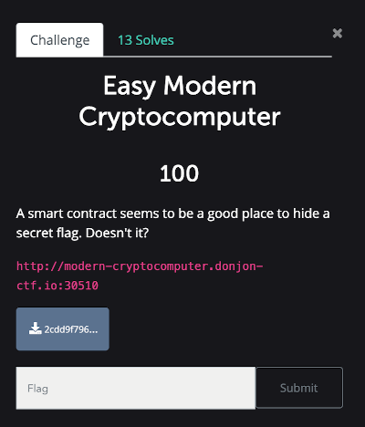
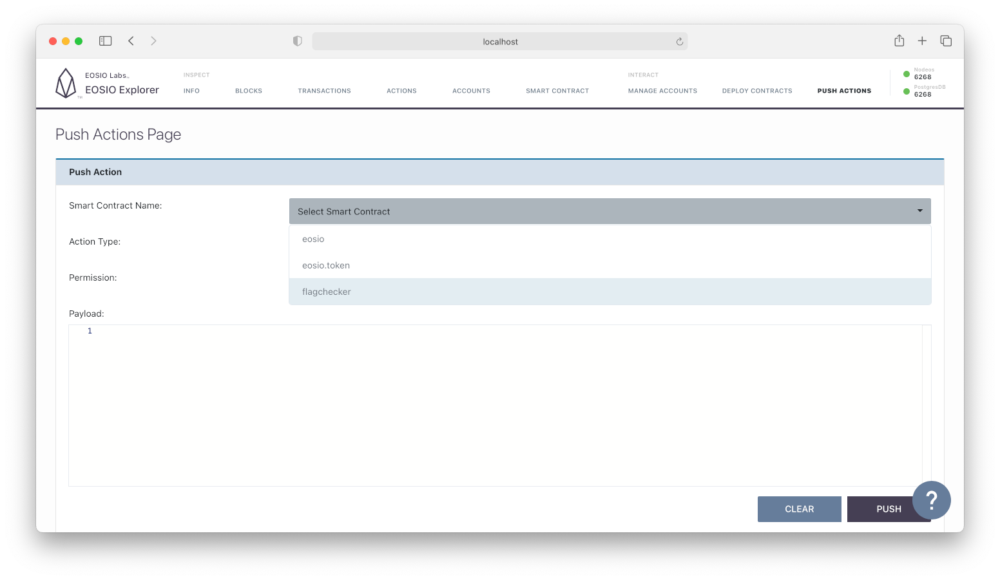
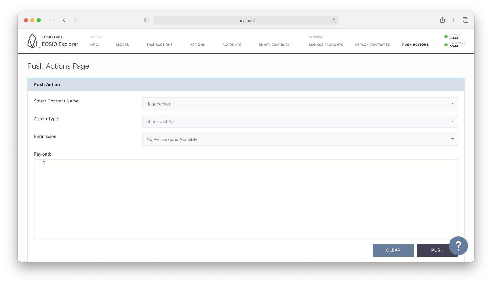

# Ledger Donjon (Easy Modern Cryptocomputer)

One of the [Ledger Donjon CTF 2020](https://donjon.ledger.com/Capture-the-Fortress/) challenges was to retrieve the flag from a smart contract.



The attachment, `2cdd9f7967b8001f817e14573a50a1dd7d4d40b2.tar.bz2`, is analyzed below.

## Quick Glance

```console
$ tree
.
├── README.md
└── container
    ├── Dockerfile
    ├── blockchain.tar.bz2
    ├── eos_patch.patch
    ├── start_genesis_nodeos
    └── start_nodeos

1 directory, 6 files
```

`README.md`

> EOSIO (https://eos.io/) is an incredible blockchain that enables users to run smart contracts, in a way that mimics modern computers (with BIOS, RAM, CPU...) but in a distributed way.
>
> An EOSIO node was revolutionized in order to provide a feature which was sadly missing in the main blockchain: CRC32 checksum computations!
But the people behind this revolution fear for the security of this blockchain.
So they added a secret flag to the virtual machine of the blockchain, that only privileged contracts (like "root users") can read.
Will you be able to steal this flag?
>
> In order to make things more accessible for newcomers, an "easy to find" flag was also inserted in a smart contract. . . .

```console
$ tar -jtf container/blockchain.tar.bz2
blockchain/
blockchain/data/
blockchain/data/state/
blockchain/data/state/shared_memory.bin
blockchain/data/state/fork_db.dat
blockchain/data/snapshots/
blockchain/blocks/
blockchain/blocks/reversible/
blockchain/blocks/reversible/shared_memory.bin
blockchain/blocks/blocks.log
blockchain/blocks/blocks.index
blockchain/config/
blockchain/config/protocol_features/
blockchain/config/protocol_features/BUILTIN-WTMSIG_BLOCK_SIGNATURES.json
blockchain/config/protocol_features/BUILTIN-RESTRICT_ACTION_TO_SELF.json
blockchain/config/protocol_features/BUILTIN-ONLY_LINK_TO_EXISTING_PERMISSION.json
blockchain/config/protocol_features/BUILTIN-DISALLOW_EMPTY_PRODUCER_SCHEDULE.json
blockchain/config/protocol_features/BUILTIN-PREACTIVATE_FEATURE.json
blockchain/config/protocol_features/BUILTIN-FORWARD_SETCODE.json
blockchain/config/protocol_features/BUILTIN-NO_DUPLICATE_DEFERRED_ID.json
blockchain/config/protocol_features/BUILTIN-ONLY_BILL_FIRST_AUTHORIZER.json
blockchain/config/protocol_features/BUILTIN-WEBAUTHN_KEY.json
blockchain/config/protocol_features/BUILTIN-FIX_LINKAUTH_RESTRICTION.json
blockchain/config/protocol_features/BUILTIN-RAM_RESTRICTIONS.json
blockchain/config/protocol_features/BUILTIN-GET_SENDER.json
blockchain/config/protocol_features/BUILTIN-REPLACE_DEFERRED.json
blockchain/config/config.ini
```

The files correspond to a patched **EOS** node.

While pocking them, the compiled smart contract and its flag (unintelligible at this stage) are detected in the shared memory.

```console
$ xxd container/blockchain/data/state/shared_memory.bin | grep -B 10 -A 10 CTF
00b32600: 0f00 419c c000 0b4d 6661 696c 6564 2074  ..A....Mfailed t
00b32610: 6f20 616c 6c6f 6361 7465 2070 6167 6573  o allocate pages
00b32620: 0075 6e65 7870 6563 7465 6420 6572 726f  .unexpected erro
00b32630: 7220 696e 2066 6978 6564 5f62 7974 6573  r in fixed_bytes
00b32640: 2063 6f6e 7374 7275 6374 6f72 0048 656c   constructor.Hel
00b32650: 6c6f 2c20 0000 41e9 c000 0b02 2100 0041  lo, ..A.....!..A
00b32660: ebc0 000b 2c20 596f 7520 6172 6520 6e6f  ...., You are no
00b32670: 7420 616c 6c6f 7765 6420 746f 2063 616c  t allowed to cal
00b32680: 6c20 7468 6973 2063 6f6e 7472 6163 742e  l this contract.
00b32690: 0000 4197 c100 0b0f 2065 6173 7966 6c61  ..A..... easyfla
00b326a0: 673d 4354 467b 0000 41a6 c100 0b02 7d00  g=CTF{..A.....}.
00b326b0: 0041 a8c1 000b 1755 6e65 7870 6563 7465  .A.....Unexpecte
00b326c0: 6420 5348 4132 3536 2073 697a 6500 0041  d SHA256 size..A
00b326d0: bfc1 000b 1455 6e65 7870 6563 7465 6420  .....Unexpected
00b326e0: 6865 7820 6368 6172 0000 41d3 c100 0b17  hex char..A.....
00b326f0: 556e 6578 7065 6374 6564 206d 656d 6f72  Unexpected memor
00b32700: 7920 7369 7a65 0000 41ea c100 0b17 2057  y size..A..... W
00b32710: 726f 6e67 2066 6c61 672c 2074 7279 2061  rong flag, try a
00b32720: 6761 696e 0000 4181 c200 0b1f 2043 6f6e  gain..A..... Con
00b32730: 6772 6174 7321 2059 6f75 2066 6f75 6e64  grats! You found
00b32740: 2074 6865 2066 6c61 6721 0000 41a0 c200   the flag!..A...
```

This is obviously the target, but how to interact with it?

## Identification of the Smart Contract

Unfamiliar with EOS, I am unable to find the smart contract using [Cleos](https://developers.eos.io/manuals/eos/latest/cleos/index). Therefore, I decide to use an explorer.

[EOSIO Explorer](https://github.com/EOSIO/eosio-explorer) appears to fit the bill. But the patched node has to be run locally and tweaked in order to enable the State History Plugin (on port 8080), [required by the explorer](https://github.com/EOSIO/eosio-explorer#note-while-connecting-to-external-nodeos-endpoint).

To do so, the following arguments are added in `start_nodeos`:

```
exec /opt/installdir/bin/nodeos \
  ··· ✂ ···
  --plugin eosio::state_history_plugin \
  --trace-history \
  --chain-state-history \
  --disable-replay-opts \
  --state-history-endpoint 0.0.0.0:8080
```

It is now time to run the node.

```console
$ docker build -t ctf-eosio .
$ docker run --rm -p 8080:8080 -p 9010:9010 -p 30510:30510 -ti ctf-eosio start_nodeos
```

As well as the explorer.

```console
$ eosio-explorer init
# Pre-existing Nodeos instance: http://127.0.0.1:30510
```

In the `Push Actions` tab, three smart contracts are automatically listed: `eosio`, `eosio.token`, and... `flagchecker`.



The *action type* (loosely speaking, the public function to call) is also specified.



Thanks to the explorer, the “entry point” is identified: contract `flagchecker`, action type `checkhashflg`.


## Interaction with the Smart Contract

### Preliminary Step

A wallet has to be created before trying to interact with the smart contract. 

To make the `cleos` command conveniently use the remote patched node, an alias is created.

```console
$ alias cleos="cleos --url http://modern-cryptocomputer.donjon-ctf.io:30510"
```

A default wallet is created and the development private key [provided by the official documentation](https://developers.eos.io/welcome/latest/getting-started/development-environment/create-development-wallet), imported *(see [Alphabet Accounts](#alphabet-accounts) for the rationale about this private key)*.

```console
$ cleos wallet create --to-console
Creating wallet: default
Save password to use in the future to unlock this wallet.
Without password imported keys will not be retrievable.
"PW5JzTGnS6vr3qBzLrbEC8jSXutFGJyVmJc2brkscHyvpJKw5s5pA"
$ cleos wallet open
Opened: default
$ cleos wallet unlock
password: # PW5JzTGnS6vr3qBzLrbEC8jSXutFGJyVmJc2brkscHyvpJKw5s5pA
Unlocked: default
$ cleos wallet import --private-key 5KQwrPbwdL6PhXujxW37FSSQZ1JiwsST4cqQzDeyXtP79zkvFD3
imported private key for: EOS6MRyAjQq8ud7hVNYcfnVPJqcVpscN5So8BhtHuGYqET5GDW5CV
```

### Flagchecker ABI

The ABI corresponding to the smart contract indicates that `checkhashflg` has to be called with `user` and `hash_flag_hex` parameters.

```console
$ cleos get abi flagchecker
{
  "version": "eosio::abi/1.1",
  "types": [],
  "structs": [{
      "name": "checkhashflg",
      "base": "",
      "fields": [{
          "name": "user",
          "type": "name"
        },{
          "name": "hash_flag_hex",
          "type": "string"
        }
      ]
    }
  ],
  "actions": [{
      "name": "checkhashflg",
      "type": "checkhashflg",
      "ricardian_contract": ""
    }
  ],
  "tables": [],
  "ricardian_clauses": [],
  "error_messages": [],
  "abi_extensions": [],
  "variants": []
}
```

The notion of `user` has to be elucidated: who can interact with this contract?

### Alphabet Accounts

From the README file:

> In order to deploy a smart contract, 2048 accounts were created. The access to these accounts is protected with the development keys documented in EOSIO's official website.

Using [the official development public key](https://developers.eos.io/welcome/latest/getting-started/development-environment/create-test-accounts), this information is quickly confirmed:

```console
$ cleos get accounts EOS6MRyAjQq8ud7hVNYcfnVPJqcVpscN5So8BhtHuGYqET5GDW5CV
{
  "account_names": [
    "abandon",
    "ability",
    "able",
    "about",
    "above",
    ··· ✂ ···
    "youth",
    "zebra",
    "zero",
    "zone",
    "zoo"
  ]
}
$ echo $(!!) | jq '.account_names | length'
2048
```

### First Interaction

Let's call the contract as `abandon` (the first account name). 

Regarding the `hash_flag_hex` parameter, from the information gathered in the shared memory (that is: `Unexpected SHA256 size`), a SHA256 placeholder is generated: `807d0fbcae7c4b20518d4d85664f6820aafdf936104122c5073e7744c46c4b87`.

A permission related error occurs:

```console
$ cleos push action flagchecker checkhashflg \
  '{ "user": "abandon", "hash_flag_hex": "807d0fbcae7c4b20518d4d85664f6820aafdf936104122c5073e7744c46c4b87" }' \
  -p abandon@active
executed transaction: 3f2b02c2984da311e314bec8bb424f7d1d3edd9db17191c80fe4be0f2c06ef00  112 bytes  497 us
#   flagchecker <= flagchecker::checkhashflg    {"user":"abandon","hash_flag_hex":"807d0fbcae7c4b20518d4d85664f6820aafdf936104122c5073e7744c46c4b87"}
>> Hello, abandon! You are not allowed to call this contract.
```

Logically, the next step is to programmatically iterate over the accounts to identify the user allowed to interact with the contract.

## Identification of the Allowed User

Here is my implementation of the following idea: fetch the account names, push action to the smart contract for each of them, and display any output that does not match the pattern of a permission issue (i.e. that does not contain the expression “not allowed”).

```python
import subprocess
import json

cleos_path = "/usr/local/bin/cleos"
node_url = "http://modern-cryptocomputer.donjon-ctf.io:30510"

# Execute cleos command
def cleos(subcommand):
  command = f"{cleos_path} --url {node_url} {subcommand}"
  result = subprocess.Popen(command, shell=True, stdout=subprocess.PIPE, stderr=subprocess.PIPE)
  out, err = result.communicate()
  return out.decode('utf-8'), err.decode('utf-8')

# Get accounts associated with dev public key
out, _ = cleos("get accounts EOS6MRyAjQq8ud7hVNYcfnVPJqcVpscN5So8BhtHuGYqET5GDW5CV")
accounts = json.loads(out)['account_names']
print(f"{len(accounts)} accounts found\n")

# Find allowed user
for i, account in enumerate(accounts):

  if i % 100 == 0:
    print(f"{i}\t{account}")

  data = json.dumps({ 
      'user': account,
      'hash_flag_hex': "807d0fbcae7c4b20518d4d85664f6820aafdf936104122c5073e7744c46c4b87"
    })

  out, err = cleos(f"push action flagchecker checkhashflg '{data}' -p {account}@active")

  if "not allowed" not in out:
      print(f"\n! {account}\n")
      print(out)
      print(err)
```

```console
$ python3 flagfinder.py
2048 accounts found

0       abandon
100     arrive
200     boil
300     cereal
400     craft
500     direct
600     enrich
700     fiscal
800     goat
900     identify
1000    laptop
1100    maze

! maze

#   flagchecker <= flagchecker::checkhashflg    {"user":"maze","hash_flag_hex":"807d0fbcae7c4b20518d4d85664f6820aafdf936104122c5073e7744c46c4b87"}
>> Hello, maze! easyflag=CTF{04f5f3fbbc08dac23645890b03dd0d72fed6c5988621e62295610ff23a377e3b} Wrong flag, try again

executed transaction: 03cc25537ad063f2623a09c20b9cd94c77c687d5d9fc80074713cd71d3a50a20  168 bytes  1032 us
warning: transaction executed locally, but may not be confirmed by the network yet         ] 

1200    noodle
1300    penalty
1400    pyramid
1500    romance
1600    siege
1700    stand
1800    three
1900    unique
2000    wheel
```

I was anticipating to be expected to find the suitable `hash_flag_hex` for the next step. However, no further action is required here: the (easy) flag is immediately revealed when the contract is called for user `maze`, *notwithstanding the contents of the provided `hash_flag_hex`.* The  `Wrong flag, try again`, triggered by the placeholder, refers in fact to the second part of the challenge.

🚩 `CTF{04f5f3fbbc08dac23645890b03dd0d72fed6c5988621e62295610ff23a377e3b}`